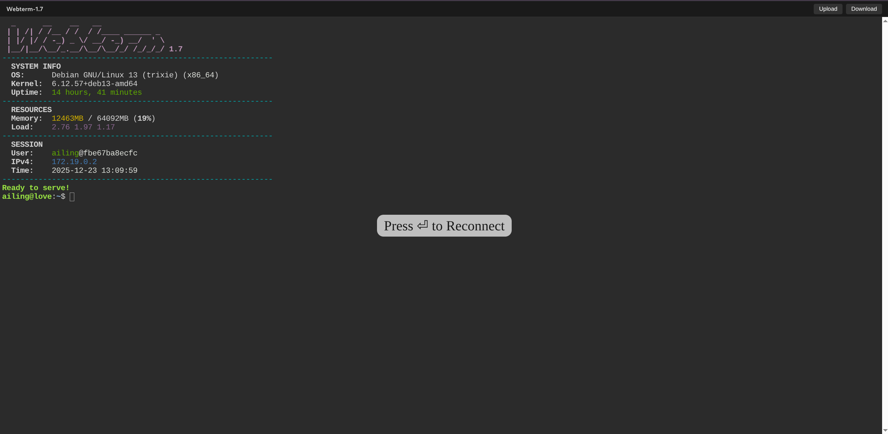

# Debian Web Terminal 🚀

Webterm 是一个基于 Debian 13 (Trixie) 构建的全功能云端终端镜像。v1.7 版本引入了原生多架构支持，并对核心连接组件与环境加载逻辑进行了深度优化。

> [!IMPORTANT]
> 本镜像仅支持 **64 位 (64-bit)** 系统环境 (x86_64, arm64)。

## ✨ v1.7 核心改进

- **原生多架构支持**: 正式支持 `x86_64` 和 `arm64` 架构。
- **集成 ttya 引擎**: 换用 `ttya` 核心，提供更为标准和高效的浏览器终端体验。
- **动态系统分析 (MOTD)**: 优化的登录欢迎信息引擎，实时显示内核版本、资源负载及网络信息。
- **规范化配置**: 变量命名更具描述性（如统一使用 `PASSWD`），并支持通过单个变量 `MOTD=false` 快速停用欢迎信息。

## 📸 预览

## 发布标签 (Docker Hub Tags)

推荐通过以下标签获取对应架构的最佳镜像：

| 架构 | 版本标签 | 最新稳定标签 |
| :--- | :--- | :--- |
| **x86_64** | `ailing2416/webterm:1.7-x64` | `x64`, `latest` |
| **arm64** | `ailing2416/webterm:1.7-arm` | `arm` |

## 功能概要

- **最新 Debian 13 环境**: 极其轻量且保持最新的软件包生态。
- **多协议支持**: 同时提供 Web 终端 (HTTP/HTTPS) 与 SSH 访问。
- **高度可扩展**: 启动时自动安装指定的包列表、同步 Dotfiles 仓库。

---
完整的配置说明与部署文档请参考 [Docker Hub](https://hub.docker.com/r/ailing2416/debian-webterm)。
示例 `MOTD` 配置文件可参考 [motd.conf](https://github.com/AiLing2416/debian-webterm/blob/main/motd.conf)。
